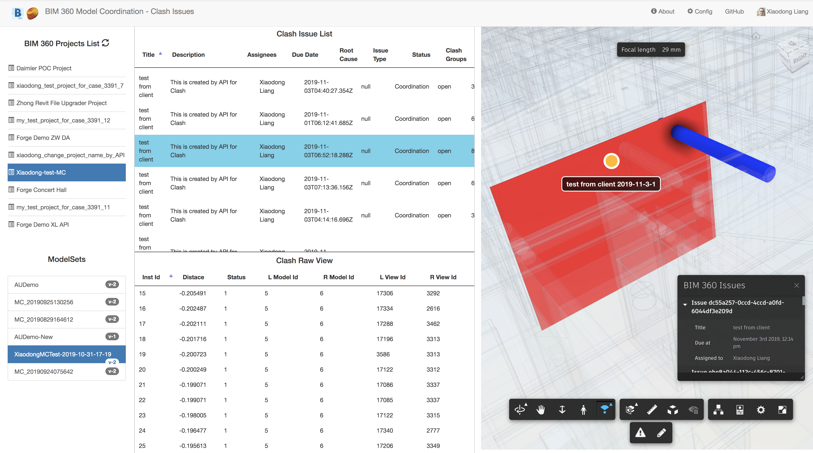
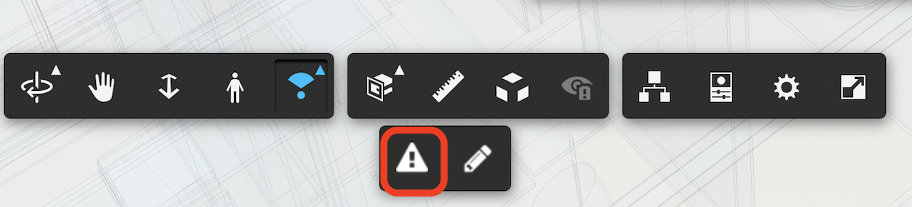
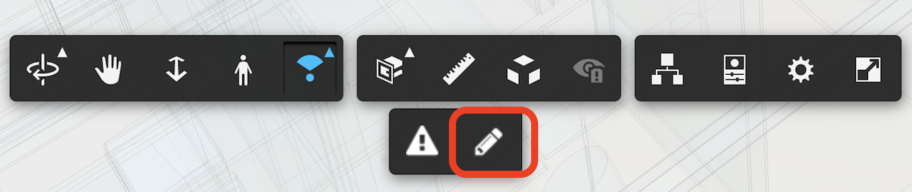
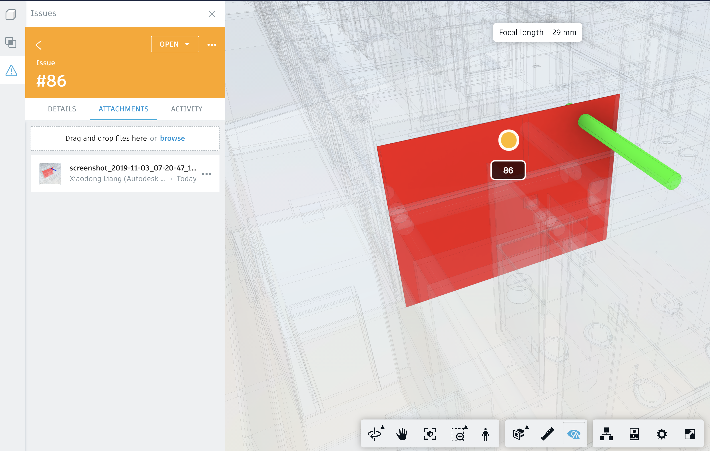

# BIM 360 Model Coordination API Sample - Clash Issues 

This repository demonstrates the scenario: analyze clash issue and create clash issue from application. 

 

## Description
This repository demonstrates the scenario: analyze clash issue and create clash issue from application. 

## Thumbnail

 
## Live version

(TO Deploy)

Watch [this video](https://youtu.be/_lPLdPvKxgA) on how to play the demo. 

## Demonstrations

1. After loging in, on top left of navigation panel, select one hub, then select one project. 
2. After selecting one projet, the active modelsets in this activeproject will be listed.
3. Click one modelset, all clash instances will be displayed in **Clash Raw Table**. All clash assigned issue of this modelset will also be displayed in **Clash Issue Table**. All documents of this modelset will also be loaded in Forge viewer
4. Select one issue in **Clash Issue Table**, the corresponding clash will be highlighted in Forge viewer. Click **Issue Icon** of Forge Viewer toolbar, the pushpin of the issues will be displayed, including a property panel with basic information of the issue.

6.  Select one issue in **Clash Raw Table** you want to create clash issue, the corresponding clash will be highlighted in Forge viewer. Click **Edit Icon** of Forge Viewer toolbar, input a title for the new issue, then click elements of the clashed objects (red/blue). The process of creating a new clash issue will start. 
 

After a while, **Clash Issue Table** will be refreshed. Switch to BIM 360 UI, check the newly created issue there. It also contains the screenshot of the clash as attachment.
 

Watch [this video](https://youtu.be/_lPLdPvKxgA) on how to play this demo.

## Technology Architecture

  < TODO >

# Setup

## Prerequisites
1. **BIM 360 Account**: must be Account Admin to add the app integration, or invited by admin of BIM admin. [Learn about provisioning](https://forge.autodesk.com/blog/bim-360-docs-provisioning-forge-apps). 
2. **Forge Account**: Learn how to create a Forge Account, activate subscription and create an app at [this tutorial](http://learnforge.autodesk.io/#/account/). Get _Forge client id_, _Forge client secret_ and _Forge callback url_ and input them to [config.js](./server/config.js)
3. Create some [modelsets of Model Coordination](https://knowledge.autodesk.com/support/bim-360/learn-explore/caas/CloudHelp/cloudhelp/ENU/BIM360D-Model-Coordination/files/GUID-38CC3A1C-92FF-4682-847F-9CFAFCC4CCCE-html.html) and **clash issue** in BIM 360. 
4. **Node.js**: basic knowledge with [**Node.js**](https://nodejs.org/en/).
5. **JavaScript** basic knowledge with **jQuery** and **Bootstrap**

## Running locally
Clone this project or download it. It's recommended to install [GitHub desktop](https://desktop.github.com/). To clone it via command line, use the following (**Terminal** on MacOSX/Linux, **Git Shell** on Windows):

    git clone  https://github.com/xiaodongliang/bim360-mcapi-node-clashissue.sample

Open the project folder in **Visual Sutdio Code**. Install the required packages, set the enviroment variables with your client ID & secret and finally start it. Via command line, navigate to the folder where this repository was cloned and use the following:

    npm install 
    node start.js

Open the browser: [http://localhost:3000](http://localhost:3000). And follow the thumbnail.gif to play the features.

## Deployment

To deploy this application to Heroku, the **Callback URL** for Forge must use your `.herokuapp.com` address. After clicking on the button below, at the Heroku Create New App page, set your Client ID, Secret and Callback URL for Forge.

Watch [this video](https://www.youtube.com/watch?v=Oqa9O20Gj0c) on how deploy samples to Heroku.
 

# Further Reading
- [BIM 360 API](https://forge.autodesk.com/en/docs/bim360/v1/overview/) and [App Provisioning](https://forge.autodesk.com/blog/bim-360-docs-provisioning-forge-apps)
- [Data Management API](https://forge.autodesk.com/en/docs/data/v2/overview/)
- [Viewer](https://forge.autodesk.com/en/docs/viewer/v7)
 

Tutorials:

- [View BIM 360 Models](http://learnforge.autodesk.io/#/tutorials/viewhubmodels)
- [Model Coordination API Document](TODO)
- [Retrieve Issues](https://developer.autodesk.com/en/docs/bim360/v1/tutorials/retrieve-issues)

Blogs:

- [Forge Blog](https://forge.autodesk.com/categories/bim-360-api)
- [Field of View](https://fieldofviewblog.wordpress.com/), a BIM focused blog

### Tips & Tricks

1. to make simple demo, this sample code does not use database to store the issue list. While in reality, it should be the administrator who can refresh the issue list. The refresh should be stored to a database. 

### Troubleshooting

1. **Cannot see my BIM 360 projects**: Make sure to provision the Forge App Client ID within the BIM 360 Account, [learn more here](https://forge.autodesk.com/blog/bim-360-docs-provisioning-forge-apps). This requires the Account Admin permission.
 
## License

This sample is licensed under the terms of the [MIT License](http://opensource.org/licenses/MIT). Please see the [LICENSE](LICENSE) file for full details.

## Written by

Xiaodong Liang [@coldwood](https://twitter.com/coldwood), [Forge Partner Development](http://forge.autodesk.com)
